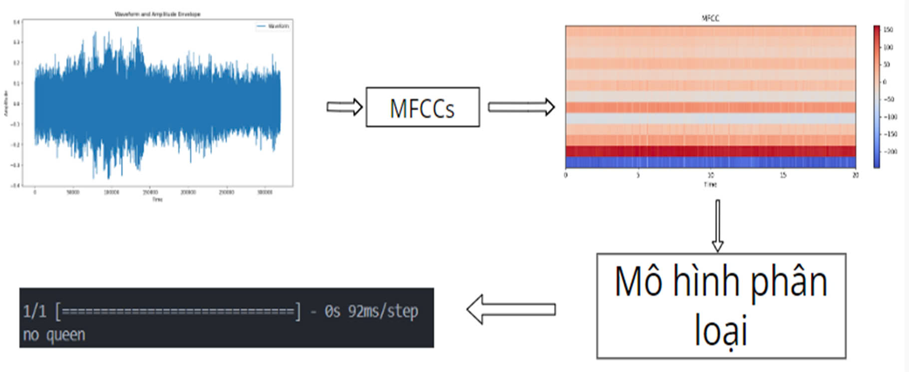
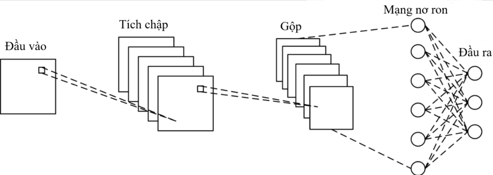
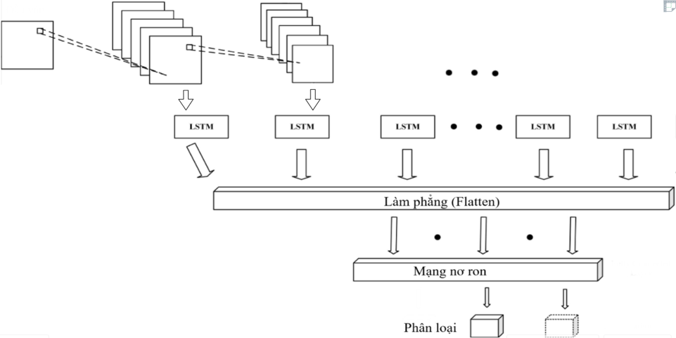

<head>
    <link rel="stylesheet" href="styles.css">
</head>

# Class Assignment

## 1. System Architecture (Proposed Model)
- **Draw the proposed system architecture (propose mode)**
- **Describe components in detail**
- **Write steps of the algorithm/propose model in code or mathematics**

## 2. Development of AI Model Application
- **Identify problems based on the proposed system architecture**
- **Develop a real-world case study application**

---

## Table of Contents
1. [System Architecture (Proposed Model)](#system-architecture-proposed-model)  
   - 1.1 [Proposed System Architecture Diagram](#proposed-system-architecture-diagram)  
   - 1.2 [Detailed Component Descriptions](#detailed-component-descriptions)  
   - 1.3 [Steps of Algorithm / Proposed Model](#steps-of-algorithm--proposed-model)  
2. [Development of AI Model Application](#development-of-ai-model-application)  
   - 2.1 [Problems Based on Proposed System Architecture](#problems-based-on-proposed-system-architecture)  
   - 2.2 [Development of Real-World Case Study Application](#development-of-real-world-case-study-application)  
3. [Discussion of Limitations and Advantages](#discussion-of-limitations-and-advantages)
4. [Additional: Model Comparison (CNN vs. LSTM + CNN)](#additional-model-comparison-cnn-vs-lstm--cnn) 

---

### 1.1 Proposed System Architecture Diagram


### 1.2 Detailed Component Descriptions
#### **Audio Data**
1. **Audio File**: Captured input.
2. **Data in Bytes**: Raw audio data.
3. **Encoding**: Convert to 16-bit depth, sample rate of 16,000 Hz.

---

#### **MFCC Computation**

1. **Pre-Emphasis**: 
   - Apply a filter to boost high frequencies. Compensates for natural attenuation during recording.
   - Example Filter: $ y(t) = x(t) - \alpha \cdot x(t-1) $, where $ \alpha \approx 0.95 $.

2. **Framing**: 
   - Divide the audio signal into short overlapping frames (e.g., 20-40 ms).
   - Common overlap: 50%.

3. **Windowing**: 
   - Apply a window function (e.g., Hamming window) to each frame to reduce spectral leakage.
   - Example: $ w(n) = 0.54 - 0.46 \cdot \cos\left(\frac{2\pi n}{N-1}\right) $.

4. **Fast Fourier Transform (FFT)**: 
   - Transform each windowed frame into the frequency domain to obtain the magnitude spectrum.

5. **Mel Filter Bank**: 
   - Apply triangular filters based on the mel scale.
   - Conversion formula: $ \text{mel}(f) = 2595 \cdot \log_{10}\left(1 + \frac{f}{700}\right) $.

6. **Logarithm**: 
   - Convert the output of the filter bank to a logarithmic scale.

7. **Discrete Cosine Transform (DCT)**: 
   - Compress the log power spectrum to create Mel Frequency Cepstral Coefficients (MFCCs).

---

### 1.3 Steps of Algorithm / Proposed Model

```python
# Steps to Compute MFCCs

def calculate_mfcc(audio_signal, sample_rate):
    # Step 1: Pre-emphasis
    signal = audio_signal[n] - (alpha * audio_signal[n-1])  # alpha = 0.95

    # Step 2: Framing
    frame_length = 25ms
    frame_shift = 10ms
    frames = split_into_overlapping_frames(signal, frame_length, frame_shift)

    # Step 3: Windowing
    for frame in frames:
        frame = frame * hamming_window(len(frame))

    # Step 4: FFT
    for frame in frames:
        spectrum = FFT(frame)
        power_spectrum = abs(spectrum) ** 2

    # Step 5: Mel Filter Bank
    mel_filters = create_mel_filterbank(num_filters=26, sample_rate=sample_rate, fft_size=len(frame))
    mel_spectrum = [apply_filterbank(power_spectrum, mel_filters) for power_spectrum in frames]

    # Step 6: Logarithm
    log_mel_spectrum = [np.log(spectrum) for spectrum in mel_spectrum]

    # Step 7: DCT
    mfcc = [DCT(spectrum)[:13] for spectrum in log_mel_spectrum]

    return mfcc
```

---

## 2. Development of AI Model Application

### 2.1 Problems Based on Proposed System Architecture
- **Speech Recognition**: Recognizing spoken words or phrases.
- **Speaker Recognition**: Identifying or verifying a speaker's identity.
- **Music Analysis**: Classifying genres or detecting beats.
- **Environmental Sound Recognition**: Identifying ambient sounds (e.g., alarms or nature sounds).

---

### 2.2 Development of Real-World Case Study Application
- **Application Idea**: Use MFCCs in an IoT project to predict bee health.

---

## 3. Discussion of Limitations and Advantages

### 3.1 Limitations
- **Sensitivity to Noise**: MFCCs require preprocessing (e.g., noise reduction) as they are not robust to background noise.
- **Assumes Stationarity**: Struggles with rapidly changing signals.

### 3.2 Advantages
- **Perceptual Basis**: The mel scale aligns with human auditory perception.
- **Compact Representation**: Reduces complex spectral information into a small set of coefficients.
- **Effective for Speech Analysis**: Emphasizes features relevant to speech and de-emphasizes irrelevant details like noise.

---

## Additional: Model Comparison (CNN vs. LSTM + CNN)

### Main Model: CNN


### LSTM + CNN Model


**Comparison**:
- Evaluate in terms of accuracy and processing speed.
